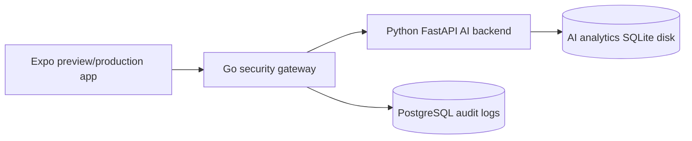

# Hosted Backend Deployment

This is the production-shaped path for testing Daily Discipline without keeping a laptop on all day.

## Recommended Hosted Shape



## Render Blueprint

The repo includes `render.yaml` with:

- `daily-discipline-ai` for the Python AI backend.
- `daily-discipline-security-gateway` for auth, rate limits, audit logs, and proxying.
- `daily-discipline-stats-aggregator` for the standalone Go stats service.
- `daily-discipline-postgres` for gateway audit logs.

Deploy steps:

1. Push the repo to GitHub.
2. In Render, create a new Blueprint from `render.yaml`.
3. Add these secret values in Render:
   - `GEMINI_API_KEY` or `OPENAI_API_KEY`
   - `ADMIN_DASHBOARD_TOKEN`
   - `SECURITY_ALLOWED_ORIGINS`
   - `AI_BACKEND_URL` pointing to the deployed Python AI service
4. Keep `SECURITY_AUTH_MODE=firebase` for tester builds.
5. Keep `APP_CHECK_MODE=optional` until the native app is sending App Check tokens.

## Expo Build Env

Set the mobile app to call the hosted Go gateway, not your laptop:

```bash
npx eas-cli@latest secret:create --scope project --name EXPO_PUBLIC_AI_API_URL --value https://your-gateway.onrender.com
npx eas-cli@latest secret:create --scope project --name EXPO_PUBLIC_REQUIRE_SECURE_AI --value true
```

Then build:

```bash
npm run eas:preview
```

## Local Full Stack

For local testing with Docker Desktop:

```bash
npm run stack:up
EXPO_PUBLIC_AI_API_URL=http://YOUR_MAC_IP:8020 npx expo start -c
```

## Health Checks

```bash
curl https://your-ai.onrender.com/health
curl https://your-gateway.onrender.com/health
```

The app Settings screen also includes AI Backend Status, Admin Analytics, Demo Mode, Crash Viewer, and Privacy controls for tester validation.

## Verify Hosted Services

After Render deploys the Python AI backend and Go security gateway, run:

```bash
HOSTED_GATEWAY_URL=https://your-gateway.onrender.com npm run hosted:check
```

Optional direct AI check:

```bash
HOSTED_GATEWAY_URL=https://your-gateway.onrender.com HOSTED_AI_URL=https://your-ai.onrender.com npm run hosted:check
```

Then set the phone app to call the gateway:

```bash
npx eas-cli@latest secret:create --scope project --name EXPO_PUBLIC_AI_API_URL --value https://your-gateway.onrender.com
npm run tester:build
```

For iOS TestFlight candidates:

```bash
npm run testflight:build
npm run testflight:submit
```

The Gemini/OpenAI keys stay only on Render. The mobile app should only receive the public gateway URL.

## Preflight Before Hosting

Run this before creating or updating hosted services:

```bash
npm run hosted:preflight
```

It checks the Render blueprint, Dockerfiles, gateway migrations, and required package scripts. It intentionally warns when local secrets are absent because real Gemini/OpenAI keys should live in Render, not git.

## Production App Check Blueprint

Use `render.yaml` while testers are still on optional App Check. Use `render.production.yaml` only when the native app is sending valid App Check tokens on every AI request.

`render.production.yaml` changes the gateway service to:

```env
SECURITY_AUTH_MODE=firebase
APP_CHECK_MODE=required
MAX_BODY_BYTES=1048576
```

Before switching to the production blueprint:

1. Confirm Firebase App Check is configured for the iOS/Android apps.
2. Confirm the mobile app sends `X-Firebase-AppCheck` to the gateway.
3. Confirm `/health` shows `app_check_mode: required`.
4. Confirm a real device can use Plan with AI through the gateway.
5. Confirm requests without App Check fail with `401` and appear in audit logs.
