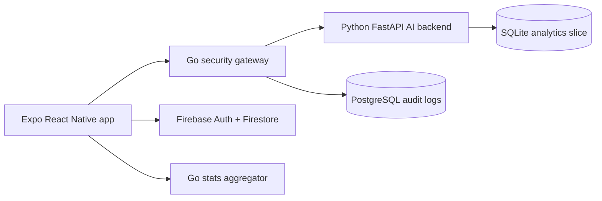

# Interview Demo Guide

This guide is the fastest way to show Daily Discipline as a full-stack portfolio project instead of only a mobile UI.

## What To Show

- React Native/Expo app with polished task planning, themes, pets, friends, focus, stats, and reminders.
- Python FastAPI AI backend for natural-language planning, reality checks, rescheduling, feedback, and task breakdowns.
- Go security gateway between the app and Python backend for token verification, rate limiting, audit logs, and admin analytics.
- PostgreSQL audit database and a separate Go stats microservice to demonstrate SQL and backend systems thinking.
- CI/CD checks, E2E smoke flow validation, and AI planner evals to prove the project is tested.

## Architecture



## Full Local Stack

Start the production-shaped backend stack:

```bash
npm run stack:up
```

Point Expo at the Go security gateway. On a real phone, use your Mac's local network IP instead of `127.0.0.1`:

```bash
EXPO_PUBLIC_AI_API_URL=http://YOUR_MAC_IP:8020 npx expo start -c
```

If Docker is not installed, run the local services directly:

```bash
npm run ai:dev
npm run security:dev
EXPO_PUBLIC_AI_API_URL=http://YOUR_MAC_IP:8020 npx expo start -c
```

## Demo Flow

1. Sign in with a test account.
2. Open Settings, then seed Demo Mode. This creates realistic tasks and stats without waiting days.
3. Open Add Task and try: `gym every day except Sunday at 6pm, study algorithms for 2 hours at 8pm`.
4. Show that recurring routines behave as ongoing loops instead of dumping weeks of duplicate tasks.
5. Open Today to complete, skip, delete, and reschedule tasks while showing feedback, haptics, sounds, and XP.
6. Open Friends and show accountability contracts.
7. Open AI Memory Timeline to show personalized pattern analysis.
8. Open Weekly Report to show the share-ready discipline recap.
9. Open Admin Analytics with token `local-admin-token` to show gateway audit metrics and completion-by-time data.

## Quality Checks

Run these before recording a demo or pushing to GitHub:

```bash
npm run qa
npm run ai:eval
npm run e2e:validate
npm run security:check
```

If Docker is installed, also validate the Compose stack:

```bash
npm run stack:config
```

## Good Interview Talking Points

- The mobile app never receives Gemini/OpenAI keys; model keys live only on the backend.
- The Go gateway is intentionally separate from the Python AI service to show defense-in-depth and clear service boundaries.
- AI features have local fallbacks so slow or unavailable models do not freeze task creation.
- Ongoing routines are loop-based, so `gym every day except Sunday` creates the next needed task instead of flooding Firestore.
- The AI eval suite catches planner regressions like wrong recurrence days, missing priorities, or bad duration parsing.
- Demo Mode makes the app testable by recruiters, friends, and testers without needing private personal data.
